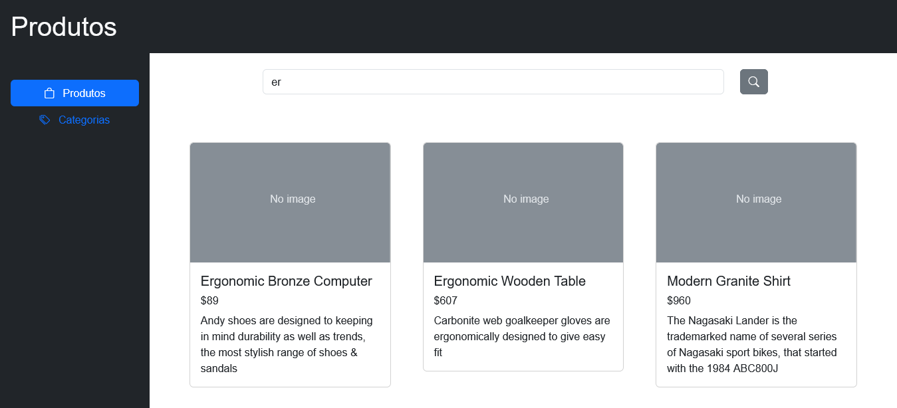

# AppTeste

Este projeto é um teste aplicado pela L5 Networks, com o objetivo de desenvolver uma aplicação front-end em estilo dashboard que se comunica com uma API REST, utilizando
`Angular 17+` e `Bootstrap`.

Foram utilizadas também as bibliotecas:

- `bootstrap-icons` para ícones;
- `ngx-infinite-scroll` para implementar scroll infinito de listagens;

## Executando o projeto com Development server

Acesse o diretório onde o projeto foi salvo, rode os comandos `npm install` e `ng serve` e navegue até `http://localhost:4200/`. A aplicação vai recarregar automaticamente se um dos arquivos-fonte forem alterados.

#### _Abaixo segue o trecho original de README gerado pela CLI do Angular._

---

This project was generated with [Angular CLI](https://github.com/angular/angular-cli) version 17.1.3.

## Code scaffolding

Run `ng generate component component-name` to generate a new component. You can also use `ng generate directive|pipe|service|class|guard|interface|enum|module`.

## Build

Run `ng build` to build the project. The build artifacts will be stored in the `dist/` directory.

## Running unit tests

Run `ng test` to execute the unit tests via [Karma](https://karma-runner.github.io).

## Running end-to-end tests

Run `ng e2e` to execute the end-to-end tests via a platform of your choice. To use this command, you need to first add a package that implements end-to-end testing capabilities.

## Further help

To get more help on the Angular CLI use `ng help` or go check out the [Angular CLI Overview and Command Reference](https://angular.io/cli) page.
